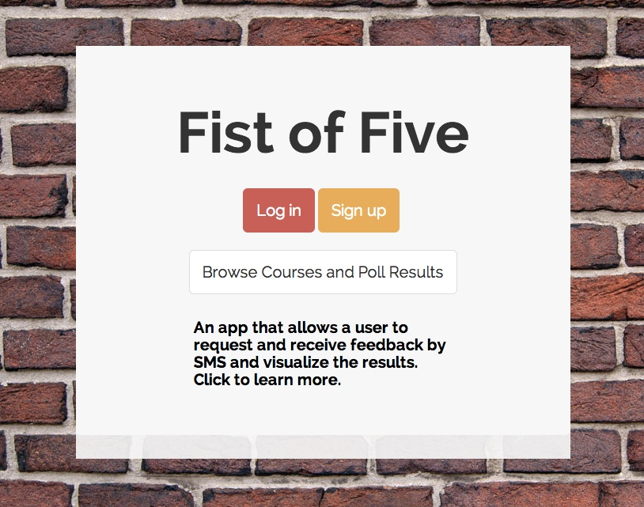
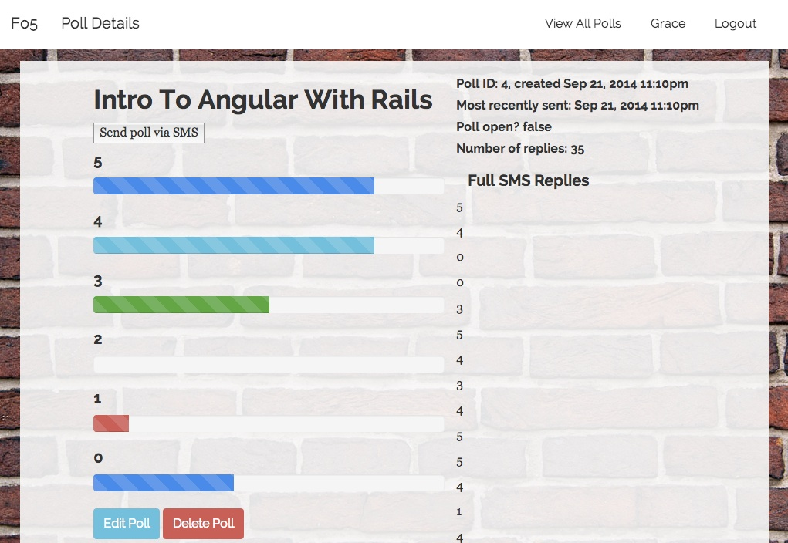
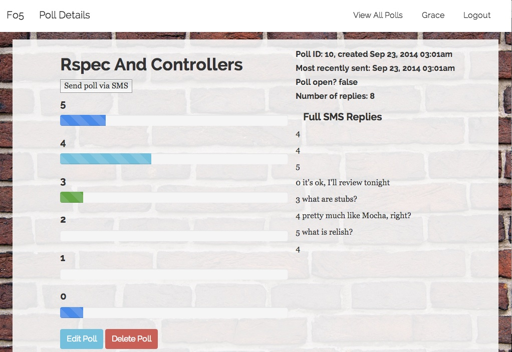

# Fist of Five - an SMS-based feedback system

An app that allows a user to elicit and receive feedback by SMS and visualize the results

* The app is deployed on Heroku [http://fistof5.herokuapp.com/](http://fistof5.herokuapp.com/)
* The source code is here on GitHub [https://github.com/lisavogtsf/fistOfFive](https://github.com/lisavogtsf/fistOfFive)

# Built with
* Ruby on Rails
* Twilio API
* PostgreSQL
* Bootstrap
* ngrok (for Twilio testing)
* RSpec

# User Flow

While teaching a difficult lesson, teachers can use the Fist of Five website to send a poll to their students via SMS, asking for their feedback on a numeric scale or in words. After waiting for students to reply, teachers refresh the poll page and the whole class can see the results displayed on the teacher's computer.  

# Motivation

Fist of Five-SMS fills a gap in existing student feedback systems, being quick, confidential and effective. An instructor creates a poll, sends it to students on their mobile phones, they reply by SMS, and then instructor and class can see the tally. 

To teach effectively, instructors need to know what students do and don't understand. To learn effectively, students need to feel comfortable giving feedback about a course. 

Here at General Assembly we have some great tools to help with this, notably the no-tech "fist of five." When a teacher calls for "fist of five," students hold up their hands with 1-5 fingers to indicate how well they are understanding the material, with 5 being effectively complete comprehension. 

This can be modified as a "blind fist of five," which puts less peer pressure on students, but it also leaves students ignorant of how their fellow classmates are feeling. 

Fist of Five-SMS provides teachers with necessary feedback while maintaining students' confidentiality and giving them a sense of where they stand compared to their classmates. 

# User Interface
Fist of Five home page, with login, signup, and browse buttons as well as explanatory text: "An app that allows a user to request and receive feedback by SMS and visualize the results."

Results of poll on Angular with Rails.

Results of poll on Rspec and Controllers, with text feedback.

# General Assembly, WDI
This app was created as my [Final Project](https://github.com/wdi-sf-july/final_project_specs) for General Assembly's Web Development Immersive, San Francisco, July, 2014 cohort.
